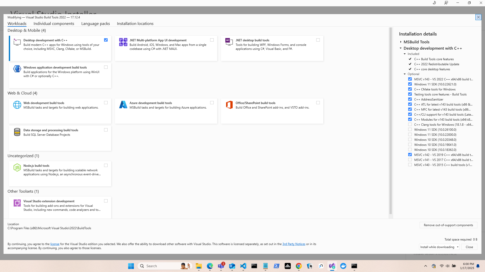
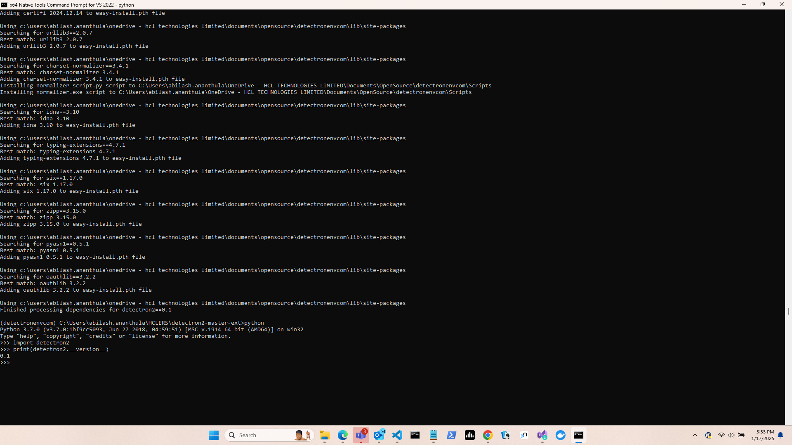

# Install Detectron2 in Windows platform
Detectron2 is a platform for object detection, segmentation and other visual recognition tasks
https://github.com/facebookresearch/detectron2

## Step-by step instructions on how to install detectron2 in Windows machine without conda

### Platform details
Windows 11 Enterprise
64-bit operating system, x64-based processor

### Make sure all the software, libraries are fully 64-bit (x64) #
### Make sure the path to the installation directory for the detectron doesn't contain any spaces (like, "/One Drive/" etc.) #

### Following are the Software, Library details

Clone the Detectron2 from, https://github.com/conansherry/detectron2
 
- Install all the build VS 2022 desktop C++ build tools, also install the community edition

   

- Install Python 3.7.0 -  create a new environment
  
- pip install torch==1.5.0+cpu torchvision==0.6.0+cpu -f https://download.pytorch.org/whl/torch_stable.html
 
- pip install git+https://github.com/facebookresearch/fvcore
- pip install cython
- pip install git+https://github.com/philferriere/cocoapi.git#subdirectory=PythonAPI 
- pip install setuptools==59.6
- pip install cmake
- pip install ninja
 
Then, open the X64 Native tools command prompt,  load the python environment, go to the detectron repo and run  
- python setup.py build develop

### Thanks #

  

